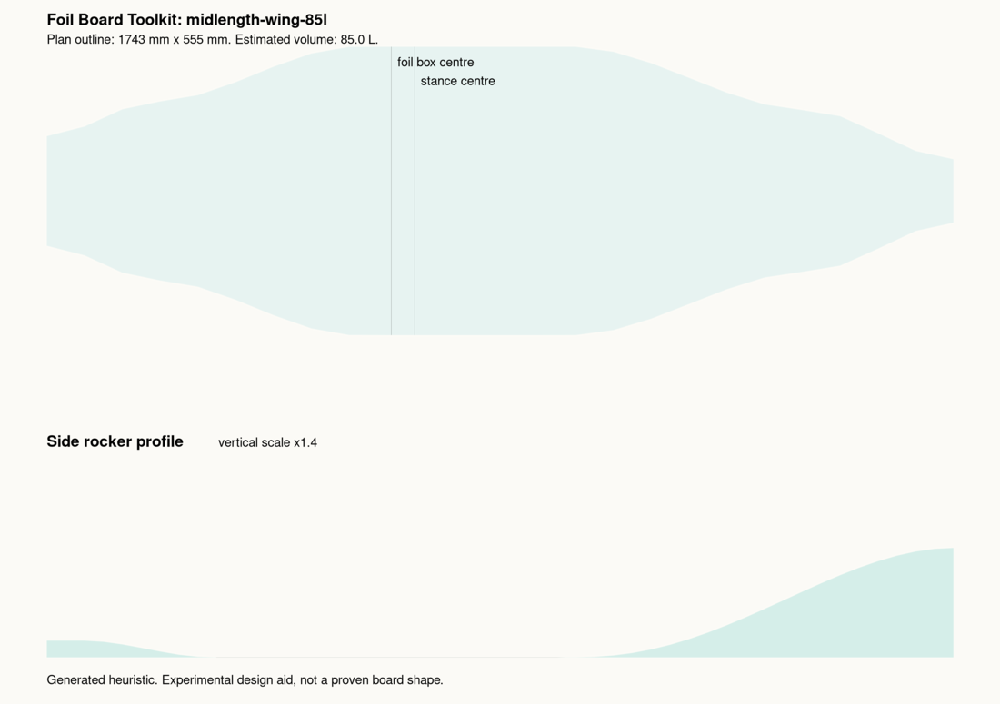
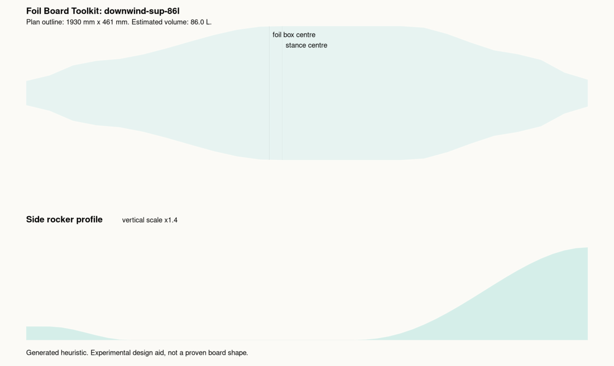
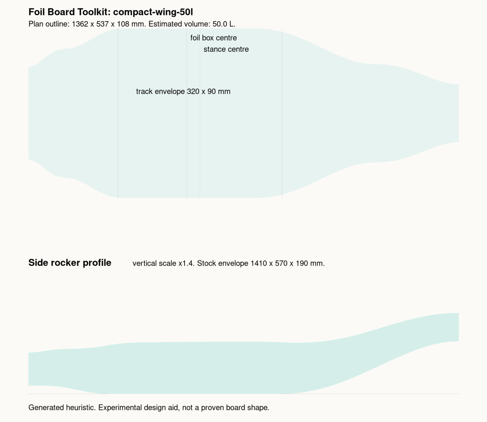
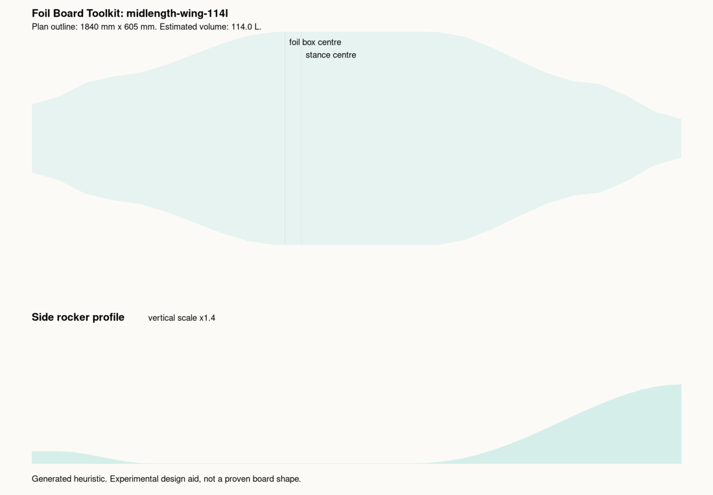
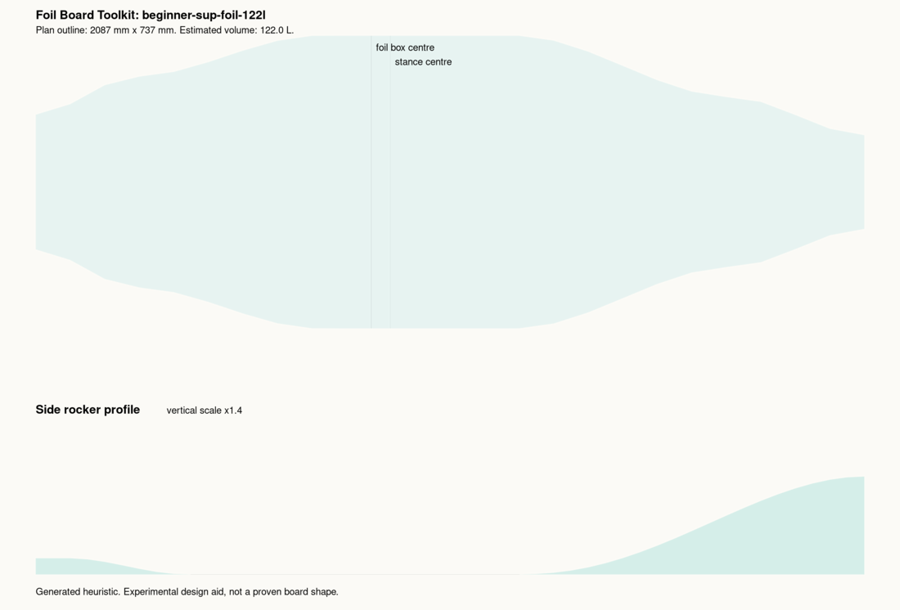
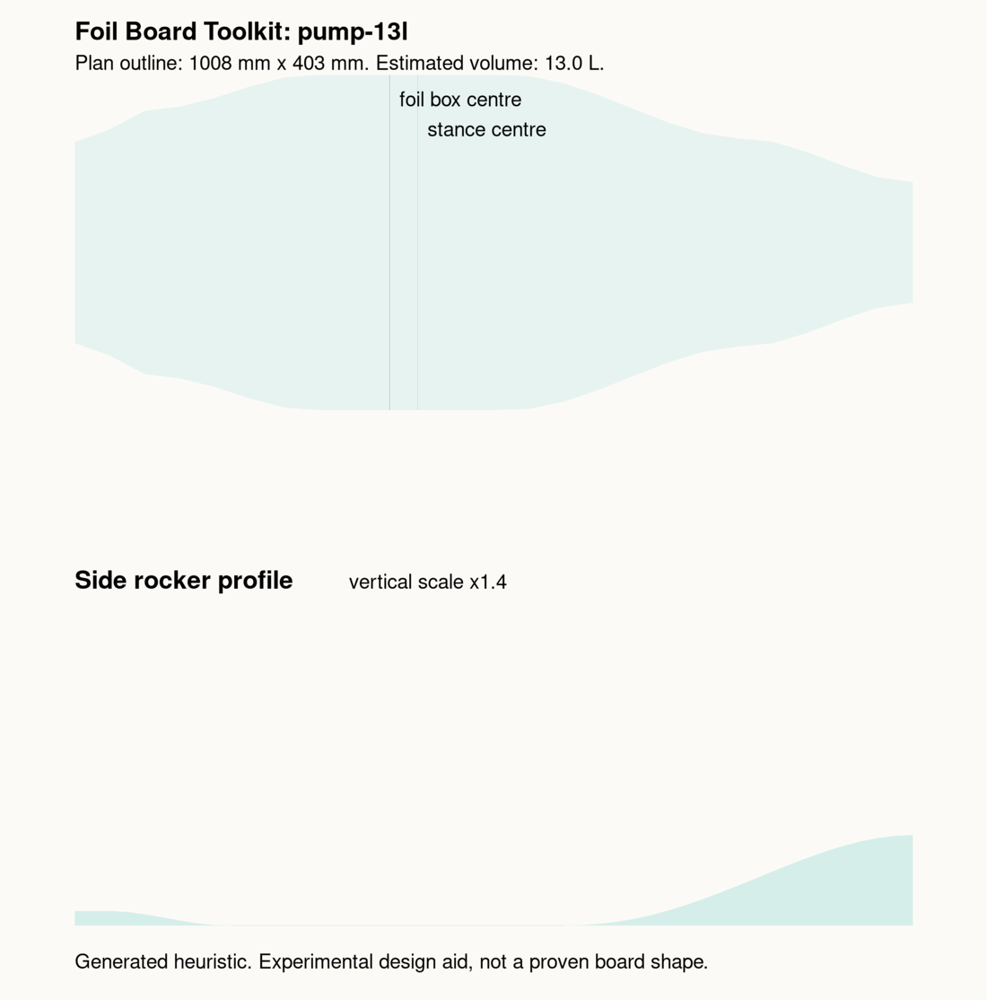
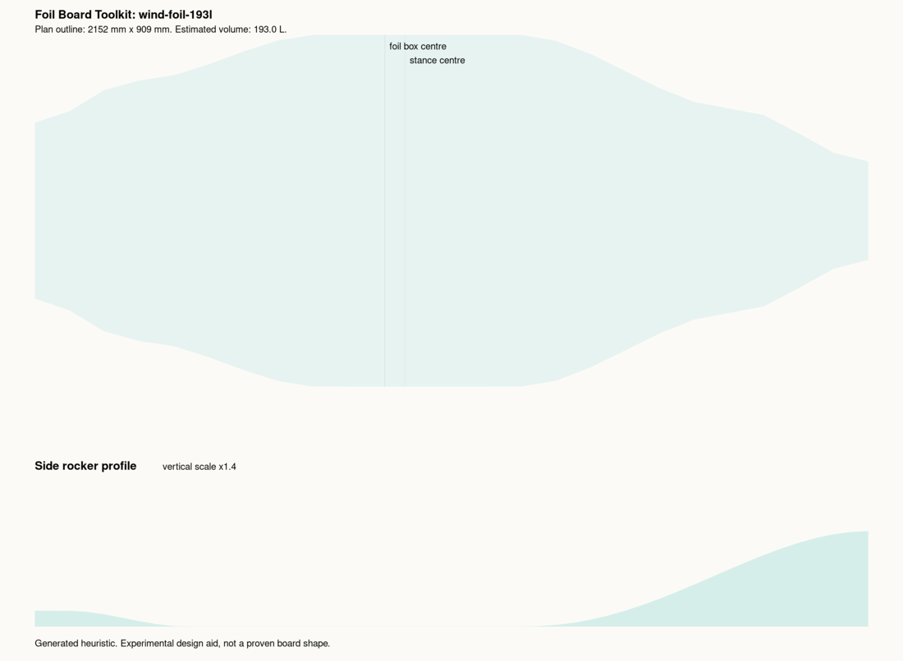

# Foil Board Toolkit

Open-source parametric foil board design tools for DIY builders, shapers, and small workshops.

The goal is to move home-built foil boards away from tracing a favourite board by eye and toward repeatable, inspectable design generation. A user should eventually be able to enter rider and use-case constraints, then generate a board definition, CAD geometry, and workshop outputs.



Current first slice: a JSON board spec becomes an SVG template, a measurable
geometry report, and a fast HTML review gallery.

- Example spec: [`examples/midlength-wing-85l.json`](examples/midlength-wing-85l.json)
- Generated SVG: [`examples/generated/midlength-wing-85l.svg`](examples/generated/midlength-wing-85l.svg)
- Geometry report: [`examples/generated/midlength-wing-85l.report.json`](examples/generated/midlength-wing-85l.report.json)
- Fast gallery: [`examples/generated/index.html`](examples/generated/index.html)
- Static README PNG preview: [`examples/generated/previews/midlength-wing-85l.png`](examples/generated/previews/midlength-wing-85l.png)

## Current Design-Family Gallery

These are visual calibration artifacts. They are reference-informed, original
heuristics, not build-ready board designs.

Review notes live in [`docs/visual-review.md`](docs/visual-review.md).

| Downwind SUP 86 L | Compact wing 50 L |
| --- | --- |
|  |  |

| Midlength wing 85 L | Midlength wing 114 L |
| --- | --- |
|  |  |

| Beginner SUP foil 122 L | Pump board 13 L |
| --- | --- |
|  |  |

| Wind foil 193 L |
| --- |
|  |

## Project Promise

Given inputs such as rider weight, target volume, discipline, foil size, skill level, and stance, the toolkit should help generate:

- overall board dimensions
- volume distribution
- rocker curve
- deck crown
- rail profile
- bottom contour
- foil box and mast reference positions
- centre of buoyancy estimate
- exported CAD/CNC artifacts

This is not a board-cloning library. We can study public dimensions, photographs, and design trends, but the output must be an original parametric generator.

## Initial Scope

MVP 1 is deliberately small:

1. Capture the domain model and legal boundary.
2. Create a simple board definition format.
3. Generate a 2D side profile and top outline from parameters.
4. Export DXF/SVG templates for visual checking.
5. Add tests that prove dimensions and volume estimates stay sane.

Not yet:

- CFD
- structural lattice optimisation
- CAM toolpaths
- full 3D CAD export
- reverse-engineered board database

Those are valuable later, but only after the small generator loop works.

## First Generator Slice

Run the example generator:

```bash
PYTHONPATH=src python3 -m foil_board_toolkit generate examples/midlength-wing-85l.json --out examples/generated/midlength-wing-85l.svg --report-out examples/generated/midlength-wing-85l.report.json
```

That creates a simple SVG containing:

- top outline
- side rocker profile
- foil box centre guide
- stance centre guide
- rough volume estimate

The report JSON contains dimensions, volume, stock envelope, foil-box location,
stance location, validation flags, and per-station measurements.

Regenerate all examples quickly:

```bash
PYTHONPATH=src python3 tools/regenerate_examples.py
```

That writes SVGs, report JSON files, and `examples/generated/index.html`.
PNG thumbnails are slow and only needed when refreshing README assets:

```bash
PYTHONPATH=src python3 tools/regenerate_examples.py --png
```

The formulas are early heuristics. Treat the SVG as a conversation starter, not a build-ready design.

## Design Inputs We Want To Learn From

Publicly visible trends from boards such as:

- Armstrong Midlength
- Armstrong DW boards
- KT Dragonfly
- Kalama Barracuda
- Amos Sultan DW boards
- Appletree Appleslice / Skipper
- Swift ML
- Mike's Lab race boards
- Axis team boards

We are looking for relationships and design ranges, not copying any one board.
The current source ledger is in [`docs/reference-sources.md`](docs/reference-sources.md).

## Candidate Outputs

- SVG profile and plan-view templates
- DXF templates
- STL preview mesh
- STEP/Fusion 360 export later
- CNC-friendly slice/blank setup later
- CAM-ready machining files later

## Safety

Foil boards operate around people, water, speed, and sharp hydrofoils. Generated designs are experimental. Build, test, and ride at your own risk.

## Licence

Apache-2.0 for the software. Generated design files need a separate policy before this project is published seriously.
